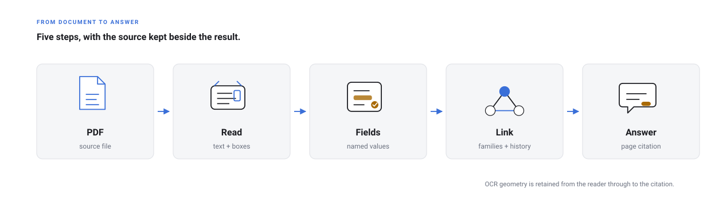

<p align="center">
  
</p>

# DIVA

## Document Intelligence with Visual Attribution

[](LICENSE)
[](pyproject.toml)
[](docker-compose.yml)

DIVA turns collections of PDFs into structured, searchable records. It keeps
the source passage and page geometry with each extracted value, so a person can
open an answer and check the document it came from.

The application is aimed at document collections where context matters: a
contract and its amendments, a group of filings, or another set of records with
named fields and relationships. You define the fields for the document domain;
DIVA reads the documents, presents the results for review, and makes them
available through chat and structured queries.

<picture>
  <source media="(prefers-color-scheme: dark)" srcset="docs/diagrams/workflow-dark.svg">
  
</picture>

## What you can do

- Upload PDFs and read them with the default local RapidOCR reader or the
  optional Azure Content Understanding reader.
- Define a field schema for a document domain instead of relying on a new set
  of labels for every document.
- Review extracted values beside their source clause, paragraph, or table row.
- Follow document families and resolve the current value of each field while
  keeping earlier values in the history.
- Ask questions in chat or use structured lookups for exact comparisons and
  totals. Answers include citations that open the relevant page.

The repository includes a small synthetic contract family for a repeatable
walkthrough. It also includes a larger public corpus; see the notes in
[`examples/real_world/`](examples/real_world/README.md) before loading it.

## Start locally

You need Docker and an API key for an OpenAI-compatible model endpoint.

```bash
git clone https://github.com/awpbash/diva.git
cd diva
cp .env.example .env
docker compose up -d
```

Open <http://localhost:8000> and follow the setup wizard. Choose **Demo** to
load the sample contracts, then ask:

> What is the current annual licence fee?

The expected answer is **SGD 61,500**, with a citation to the First Amendment.
The sample is deliberately arranged so that the current answer comes from the
newest document that states that field, rather than simply from the newest
document overall.

For the complete walkthrough, including field review and corrections, read
[Getting started](docs/getting-started.md). For a scripted setup, use:

```bash
pip install -r requirements.txt
python -m scripts.setup --check
```

## How the pieces fit

DIVA is shipped as one application image. The React web app is built into the
image and served by FastAPI. The application writes source files and cached
pipeline artifacts under `storage/`, and writes its searchable knowledge
projection to Azure Cosmos DB or the local emulator.

The ingestion path is:

1. Render the PDF into page images.
2. Read text and page geometry.
3. Fill the configured fields and attach their evidence.
4. Build document and entity relationships.
5. Serve answers with citations and a page-level view of the evidence.

The current container uses RapidOCR with PP-OCR-derived ONNX models for the
local OCR path. It does not install the `paddleocr` package. See
[Pipeline overview](docs/PIPELINE_OVERVIEW.md) for the reader switch and the
geometry path.

## Define your document domain

A domain is configuration that describes the documents and fields your instance
serves. The shipped `commercial_agreement` domain is a starting point. The
authoring guide covers the four main files, validation, evidence settings, and
document-family relationships:

[Define a document domain](docs/domains.md)

## Documentation map

| If you want to… | Read |
| --- | --- |
| Install DIVA and try the sample | [Getting started](docs/getting-started.md) |
| Understand the design | [Concepts](docs/concepts.md) |
| See the runtime components | [Architecture](docs/architecture.md) |
| Follow one PDF through ingestion | [Pipeline overview](docs/PIPELINE_OVERVIEW.md) |
| Understand answers and citations | [Retrieval](docs/retrieval.md) |
| Change the domain schema | [Domains](docs/domains.md) |
| Find settings, commands, and endpoints | [Reference](docs/reference.md) |
| Deploy or diagnose an instance | [Deployment](docs/DEPLOYMENT.md) · [Troubleshooting](docs/troubleshooting.md) |
| Change the code or documentation | [Contributing](CONTRIBUTING.md) |

The full index is in [`docs/README.md`](docs/README.md). The pages under
`pipeline/`, `api/`, `web/`, `configs/`, and `tests/` are narrower maintainer
notes for the corresponding source directories.

## Contributing

DIVA is intended to be adapted to new document domains. Contributions are
welcome in the code, configuration, examples, tests, and documentation. Start
with [Contributing](CONTRIBUTING.md), and please use synthetic or public
documents in issues and pull requests.

## Licence

MIT. See [LICENSE](LICENSE).
