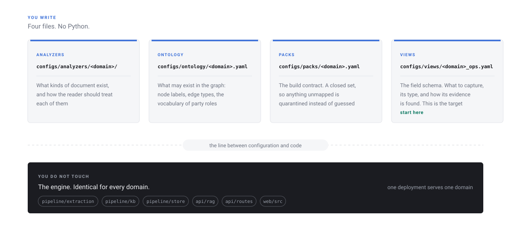
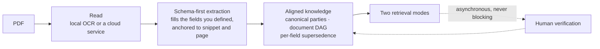

# Verbatim

**Ask questions of a pile of PDFs and get answers you can check.**

[](LICENSE)
[](pyproject.toml)
[](docker-compose.yml)

Every answer is built only from your documents, cites the clause it came from,
and clicking a citation highlights that exact paragraph on the page. "Not in
the documents" is a correct answer. A confident guess is a defect.

It is a complete application, not a library: a Python backend, a React
workspace, and the retrieval logic in between. Clone it, run one setup
command, upload a PDF, and ask it something.

<picture>
  <source media="(prefers-color-scheme: dark)" srcset="docs/diagrams/evidence-chain-dark.svg">
  
</picture>

> [!WARNING]
> **Before you deploy this anywhere shared, read [SECURITY.md](SECURITY.md).**
> Sign-in is passwordless by design: an email address alone signs you in. That
> is fine on your own machine and behind your own network. It is not
> authentication for the open internet.


The screenshots on this page were taken against the three synthetic contracts
in [`examples/`](examples), which ship with the repository so you can reproduce
every one of them.

---

## What makes it different

Most retrieval systems mine open-ended text and hope the pieces line up. This
one inverts that. **You write a field schema. A model fills it in, anchoring
every value to a verbatim snippet and a rectangle on the page. A person
verifies each field against that highlight.**

Once every document has filled the same verified fields, the hard
cross-document work falls out of ordinary code instead of model guesswork:
which rate is currently in force across an amendment chain, what the deposits
add up to, which of five versions of a clause is the live one.

Here is the part that is easy to get wrong, and the reason the sample corpus
exists:

<picture>
  <source media="(prefers-color-scheme: dark)" srcset="docs/diagrams/supersedence.gif">
  
</picture>

"Read the newest document" gets the fee wrong. "Read the base contract" gets
the term wrong. The answer is a per-field walk backwards along a chain the
documents declare about themselves, and it is deterministic code with no model
involved.


## What you get

| | |
| --- | --- |
| **Chat with real citations** | Answers stream in with clause-level sources. Click one and the PDF opens on that page with the paragraph highlighted |
| **A verification workspace** | Every extracted field with its evidence, triaged so uncertain and high-value fields come first. Approve, reject, or correct. Several reviewers vote and the majority decides |
| **Aligned cross-document knowledge** | Canonical parties, the amendment chain between documents, and the current value of every field with its history behind it |
| **A graph explorer** | The knowledge structure as an actual graph, filtered to what an answer used |
| **An admin area** | Upload a PDF and extraction starts. Accounts, roles, usage, activity, feedback, and live schema editing |
| **Role-based access, enforced server-side** | A user without clearance never receives the confidential value. The browser is not trusted to hide it |

---

## Quick start

You need Docker and an API key for any OpenAI-compatible model endpoint.
That is genuinely all: a setup wizard runs in the browser and does the rest,
no file to hand-edit.

```bash
git clone https://github.com/awpbash/verbatim.git && cd verbatim
cp .env.example .env            # nothing to fill in, the wizard asks for your key
docker compose up -d            # the database and the app, on http://localhost:8000
```

Open <http://localhost:8000>. A short wizard walks you through naming the
instance, creating your admin account, and pasting in a model API key, tested
live before it lets you continue. Then it asks how to start:

| Path | What you get |
| --- | --- |
| **Demo** | The three sample contracts in [`examples/corpus/`](examples/corpus) load automatically, built to demonstrate exactly the failure shown above |
| **Ready-made, as-is** | The shipped `commercial_agreement` schema, untouched: licence, supply and non-disclosure fields |
| **Clone and edit** | That same schema as a starting point, reshaped in the browser before you finish |
| **Build from scratch** | Describe your kind of document in a sentence, let it draft a first field list, then edit it. Two switches turn on document-chain tracking and cross-document party matching if you need them |

Finishing restarts the app once and signs you straight in, no separate login
step. **[Getting started](docs/getting-started.md)** walks the whole thing
end to end in about twenty minutes.

For a server rather than a laptop, read
**[Deployment](docs/DEPLOYMENT.md)**. It covers the production compose file,
the reverse proxy, what to back up, and the authentication decision you have
to make before exposing an instance.

### Without Docker

```bash
python -m uvicorn api.main:app --reload --port 8000
cd web && npm install && npm run dev      # http://localhost:5173
```

Same wizard, same questions, just against the dev server instead of the
Docker build. You still need somewhere to put the knowledge store.
`docker compose up -d cosmos` is the easy answer, and what it holds is a
disposable projection: if you lose it, `python -m scripts.rebuild_kb` rebuilds
everything from your local files for free, with no model calls.

**On Windows**, set `PYTHONUTF8=1` and run everything as a module
(`python -m scripts.rebuild_kb`, never `python scripts/rebuild_kb.py`).

### Advanced: scripted setup, no browser

Everything the wizard does, you can also do by hand, which is the right
choice for scripting a deployment or for CI:

```bash
pip install -r requirements.txt

cp .env.example .env            # put your key in OPENAI_API_KEY
docker compose up -d cosmos     # just the local database

python -m scripts.setup         # checks everything, creates what is missing
docker compose up -d            # the app
```

`scripts/setup` runs seven checks in dependency order and stops at the first
real problem, so the output names the one thing to fix. It creates the
database, the container, and the first admin account. It costs nothing and
calls no model. Re-run it any time. `--check` reports without changing
anything:

```
$ python -m scripts.setup --check

[  ok  ] Python 3.12
[  ok  ] Python dependencies
[  ok  ] Configuration source
         Read from .env
[  ok  ] Model API key
         Routing model calls to api.openai.com.
[  ok  ] Domain
         commercial_agreement
[  ok  ] Configuration
         12 node labels, 22 schema fields in 8 categories.
[  ok  ] Knowledge store
         http://localhost:8081 -> verbatim/kb
[  ok  ] Accounts
         Sign in as: admin@localhost
```

This path signs you in as `admin@localhost` (or `BOOTSTRAP_ADMIN_EMAIL`)
rather than an account you named yourself, since there is no wizard step to
ask.

---

## Teaching it your documents

The engine has no idea what a contract is. Everything domain-specific lives in
four config files, and adding a document type means writing them, not writing
Python.

<picture>
  <source media="(prefers-color-scheme: dark)" srcset="docs/diagrams/domain-layers-dark.svg">
  
</picture>

The field schema is the important one. It is the canonical target, and it is
why this approach avoids the problem where the same concept comes back under
six different names across a corpus. A bounded, named field does not drift the
way an open-ended extracted phrase does.

**One deployment serves one domain.** It resolves once at startup, from
`VERBATIM_DOMAIN` or `configs/pipeline.yaml`. With more than one pack present
and no declaration, the app refuses to start rather than guess, because
guessing means extracting every document against the wrong schema.

The full authoring guide, including every evidence mechanism and the document
family policy, is in **[Domains](docs/domains.md)**.

The repository ships `commercial_agreement` as a worked example: licence,
supply and non-disclosure agreements in 22 fields. The project this was
extracted from runs a completely different domain, with a physical equipment
tier and its own party vocabulary. That is the test rather than an accident:
the contract tests run over every domain a checkout ships, so "this is
configurable" is something the suite checks rather than something a README
claims.

---

## How it works



Verification is deliberately not in the line. A document is searchable the
moment it lands, and review upgrades its trust tier afterwards. A correction
becomes a definition or a rule, so the next document resolves on its own.

Everything after reading the pages is deterministic Python with no model
involved, which is why rebuilding the knowledge base is free.

<picture>
  <source media="(prefers-color-scheme: dark)" srcset="docs/diagrams/retrieval-modes-dark.svg">
  
</picture>

The citation backbone survives every layer: value, to evidence snippet, to
page and rectangle. That is what the viewer draws, and it is why a reviewer
can trust what they are approving.

---

## Documentation

| | |
| --- | --- |
| [Getting started](docs/getting-started.md) | Clone to a cited answer, in about twenty minutes |
| [Concepts](docs/concepts.md) | Why it is built this way, and what it deliberately does not do |
| [Domains](docs/domains.md) | Point it at your own kind of document |
| [Architecture](docs/architecture.md) | What talks to what, and where state lives |
| [Reference](docs/reference.md) | Every setting, command and endpoint |
| [Troubleshooting](docs/troubleshooting.md) | Symptom, cause, fix |
| [Deployment](docs/DEPLOYMENT.md) | Putting it on a server |
| [Examples](examples/README.md) | The sample corpus and ten questions with their answers |

The full index, including the deeper engine documentation, is in
[`docs/`](docs/README.md).

---

## Configuration

Every environment difference is an environment variable. Same image on a
laptop, a small cloud box, or a private tenant. See
[`.env.example`](.env.example) for the annotated list and
[Reference](docs/reference.md) for the tables.

| | Variable | Options |
| --- | --- | --- |
| Model endpoint | `OPENAI_BASE_URL` | Unset for OpenAI. Point it at any OpenAI-compatible endpoint, including one inside your own network |
| Reader | `READER` | `rapidocr`: local OCR plus a correction pass, no cloud service needed. `cu`: Azure Content Understanding, one paid call per document, cached |
| Vector search | `COSMOS_VECTOR_MODE` | `client`: exact, in memory, right for development. `native`: the database's own index, for a real account |
| Domain | `VERBATIM_DOMAIN` | Which document schema this instance serves |
| Name | `APP_NAME` | What the instance calls itself. Served to the browser, so a rename is a restart |
| First admin | `BOOTSTRAP_ADMIN_EMAIL` | The account created on first boot |

**Your documents go to the model endpoint you configure.** If they cannot
leave your network, host the endpoint yourself. Nothing else phones home.

## Access levels

Sessions carry a role, resolved on the server. The client never chooses its
own clearance.

| Role | Can reach |
| --- | --- |
| `admin` | Everything, plus review, accounts, schema editing, upload, and the feedback inbox |
| `confidential` | Chat, knowledge, and explore, including values tagged confidential |
| `default` | Chat only, with confidential values withheld before they leave the server |

The verifier flag opens the review workspace independently of role, because
verification is a vote and it needs more than one person, but only vetted
people.

---

## Measurement

The project's own quality gate is a free, deterministic scorer that grades
extraction field by field against human-verified gold: correct, correctly
abstained, missed, wrong, invented, plus whether the evidence link holds.

```bash
python -m eval.extraction.score --run NAME
```

Run it rather than trusting a number in a README. This public branch does not
ship the private gold set from the original project; create one for your own
domain with `python -m eval.extraction.score --dump`, check it in privately,
and use it as your extraction regression gate.

**Retrieval accuracy is currently unmeasured on this branch.** The tool-routing
layer was rewritten when the open-vocabulary extraction tier was retired, and
the older question-answering numbers were measured against the previous
design. They are not carried forward here, because a stale number is worse
than no number.

The deterministic suite is free and runs in about fifteen seconds:

```bash
python -m pytest tests/       # no model calls, no live database
python -m ruff check .
cd web && npm run build
```

## Costs

Two things cost money, and both are cached so you pay once.

- **Ingesting a document.** It scales with pages, and reading them dominates.
  The three PDFs in the sample corpus came to about 27,000 tokens. A long
  scanned contract is a different order of magnitude. Re-running is free.
- **Asking a question.** Small change per question, several tool calls each.

For a sense of scale: loading the sample corpus, filling the schema three
times over while tuning it, and asking about twenty questions came to 224,000
tokens in total.

Everything else, rebuilding the knowledge base, scoring extraction, running
the tests, is free and calls no model. That is deliberate: you should be able
to verify a change without a funded API key.

---

## Repository layout

| Path | What |
| --- | --- |
| `pipeline/extraction/` | Reader, schema-first extraction, evidence anchoring |
| `pipeline/kb/` | Knowledge build, alignment, the amendment chain, supersedence |
| `pipeline/store/` | The only code that talks to the database |
| `configs/` | The whole domain definition: analyzers, ontology, packs, field schemas, prompts |
| `api/` | FastAPI backend: retrieval agent, auth, review, knowledge, admin |
| `web/` | React workspace |
| `scripts/` | Operational commands: `setup`, `accounts`, `rebuild_kb`, `reconcile_kb`, `ask` |
| `examples/` | The sample corpus and its expected answers |
| `eval/` | The extraction scorer |
| `tests/` | Fast, offline, no model calls |
| `docs/` | Documentation, and the source for every figure in it |

## Contributing

See [CONTRIBUTING.md](CONTRIBUTING.md). The short version: open an issue
first, run the three free checks before opening a pull request, and do not add
per-document special cases.

## Licence

MIT. See [LICENSE](LICENSE).
