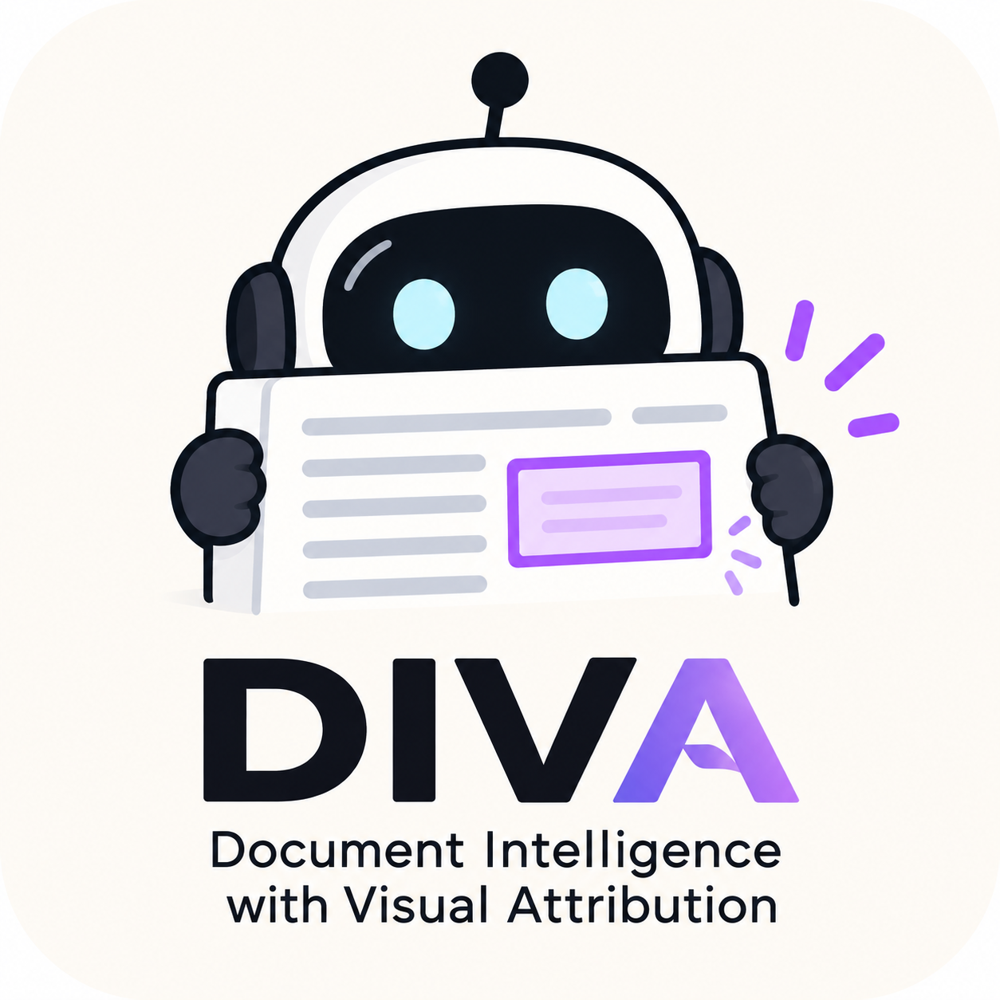
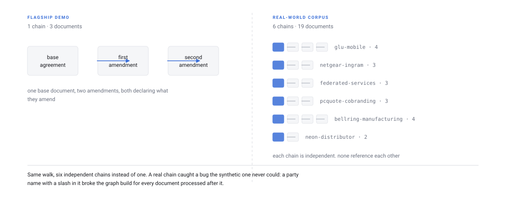
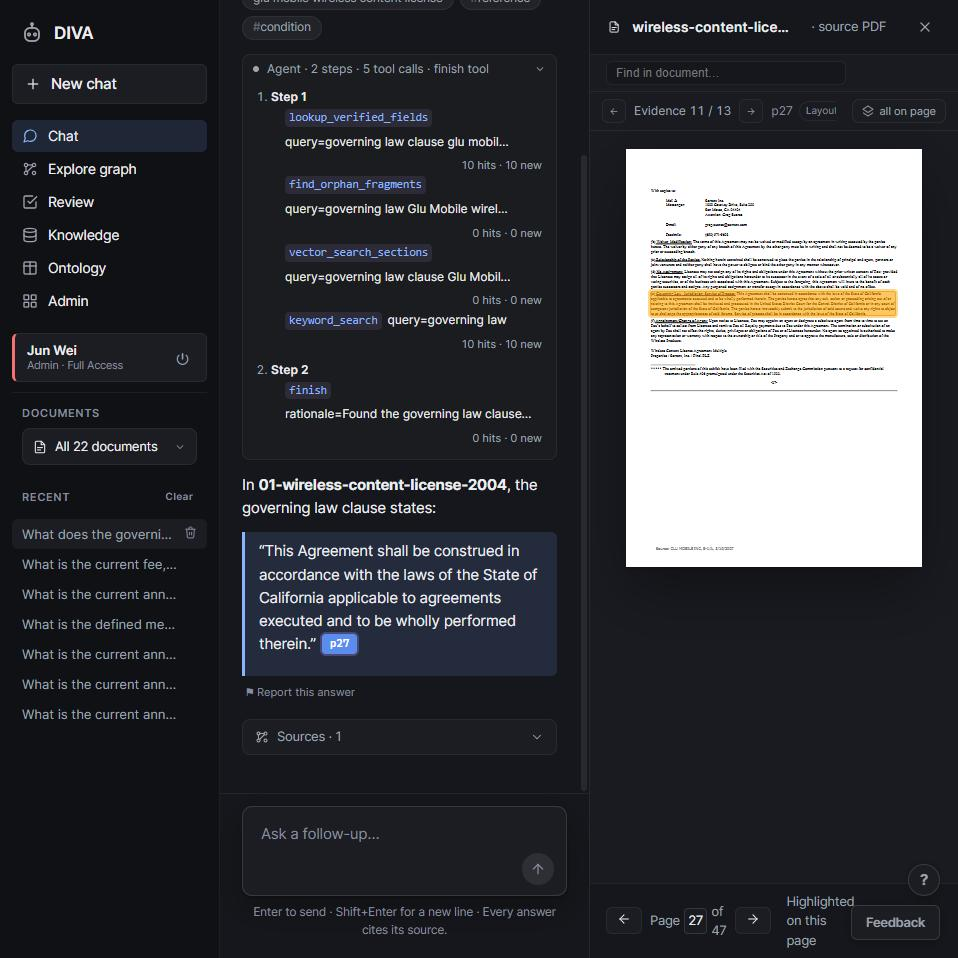
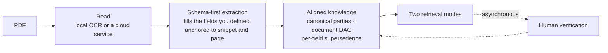

<p align="center">
  
</p>

# DIVA

## Document Intelligence with Visual Attribution

[](LICENSE)
[](pyproject.toml)
[](docker-compose.yml)

DIVA is an open-source document intelligence application for turning collections
of PDFs into structured, reviewable knowledge. It combines schema-driven
extraction, document relationship modeling, human verification, and evidence-
aware retrieval so that an answer can be followed back to the exact passage
and location that supports it.

The name describes the central design principle: DIVA gives document content
intelligence while preserving a visual attribution for every extracted value.
Each answer can therefore be read in context, checked against the source page,
and carried forward into a knowledge model that understands how documents
relate to one another over time.

<picture>
  <source media="(prefers-color-scheme: dark)" srcset="docs/diagrams/evidence-chain-dark.svg">
  
</picture>

DIVA is designed as a complete application rather than a library: a Python
backend, a React workspace, and the retrieval and knowledge services between
them. After the initial setup, an operator can upload a PDF, define the fields
that matter for a document domain, review the resulting evidence, and ask
questions through the same workspace.


The screenshots on this page use the three synthetic contracts in
[`examples/`](examples), which are included so that the complete walkthrough
can be reproduced from a fresh checkout.

## What DIVA provides

### Schema-driven document intelligence

DIVA begins with a field schema that describes the information a domain needs.
The extraction models then populate those named fields against the source
documents, preserving both the value and the evidence that supports it. This
gives a document collection a consistent vocabulary and makes the resulting
knowledge straightforward to inspect, compare, and query.

### Visual attribution for every value

Every extracted value is associated with a verbatim source snippet and a
rectangle on the rendered page. Reviewers can open a citation and see the
precise clause, table row, or paragraph from which the value was obtained,
which makes verification part of the normal workflow rather than a separate
investigation.

### Knowledge that follows document relationships

Documents can describe their relationships to one another, including
amendments and related document families. DIVA uses those relationships to
resolve the current value of each field independently, while preserving the
historical values and the document that established each one.

<picture>
  <source media="(prefers-color-scheme: dark)" srcset="docs/diagrams/supersedence.gif">
  
</picture>

This per-field resolution model is useful for document families in which one
amendment changes a fee while another changes a term. DIVA can identify the
governing source for each field and present the resulting value together with
its citation and history.


### Designed for real document collections

The repository includes a second corpus of nineteen real contracts drawn from
public SEC filings. It contains six independent amendment chains and provides
a larger, more varied setting for exploring ingestion, evidence review, and
cross-document retrieval. The corpus and its licensing notes are documented in
[`examples/real_world/`](examples/real_world/README.md).

<picture>
  <source media="(prefers-color-scheme: dark)" srcset="docs/diagrams/scale-dark.svg">
  
</picture>

The real-world collection also includes a complete citation walkthrough for a
governing-law clause from a scanned SEC filing, showing how DIVA carries the
same evidence relationship from extraction through the answer workspace.



| Capability | Description |
| --- | --- |
| **Evidence-grounded chat** | Questions produce answers with clause-level citations, and selecting a citation opens the relevant PDF page with the supporting passage highlighted. |
| **Verification workspace** | Extracted fields are presented with their evidence so reviewers can approve, reject, or correct values, with multi-reviewer voting available for shared workflows. |
| **Aligned document knowledge** | Parties, document families, amendment relationships, current field values, and historical values are represented together in a queryable knowledge model. |
| **Graph exploration** | The document and entity relationships can be explored visually, including the portions of the graph used to support an answer. |
| **Administrative workspace** | Operators can upload documents, manage accounts and roles, monitor activity, review feedback, and edit schemas from the application. |
| **Server-side access control** | Roles and sensitivity labels are enforced before data reaches the client, allowing deployments to separate general, confidential, and administrative access. |

## Quick start

DIVA requires Docker and an API key for an OpenAI-compatible model endpoint.
The browser setup wizard creates the initial configuration and walks through
the first administrator account, so a new instance can be started without
hand-editing a configuration file.

```bash
git clone https://github.com/awpbash/diva.git && cd diva
cp .env.example .env
docker compose up -d
```

Open <http://localhost:8000> and follow the setup wizard. It asks for the
instance name, creates the first administrator account, and tests the model
connection before completing the setup. The available starting paths are:

| Starting path | Description |
| --- | --- |
| **Demo** | Loads the three sample contracts from [`examples/corpus/`](examples/corpus), which are prepared for the guided walkthrough. |
| **Ready-made, as-is** | Uses the shipped `commercial_agreement` schema for licence, supply, and non-disclosure documents. |
| **Clone and edit** | Starts with the same schema as a foundation that can be reshaped in the browser. |
| **Build from scratch** | Drafts an initial field list from a description of the document domain, after which the schema and document relationship options can be refined. |

The full walkthrough, including the sample questions and verification flow, is
available in [Getting started](docs/getting-started.md). For a server
deployment, see [Deployment](docs/DEPLOYMENT.md) for the production compose
file, reverse proxy configuration, backups, and access settings.

### Running without Docker

```bash
python -m uvicorn api.main:app --reload --port 8000
cd web && pnpm install && pnpm run dev
```

This uses the same setup flow against the development server. A local
knowledge store can be started with `docker compose up -d cosmos`, and the
knowledge projection can be rebuilt from the files in `storage/` with
`python -m scripts.rebuild_kb`.

On Windows, set `PYTHONUTF8=1` and run operational commands as modules, such
as `python -m scripts.rebuild_kb`.

### Scripted setup

For deployments and CI environments, the browser wizard can be replaced by a
fully scripted setup sequence:

```bash
pip install -r requirements.txt

cp .env.example .env
docker compose up -d cosmos

python -m scripts.setup
docker compose up -d
```

The setup command checks the environment in dependency order, creates missing
resources, and can be run again safely. Use `python -m scripts.setup --check`
to inspect the configuration without changing it.

## Defining a document domain

DIVA separates the reusable document intelligence engine from the vocabulary
of a particular document collection. A domain is described through
configuration files for its analyzers, ontology, field schema, and prompts;
adding a new document type therefore begins with describing the information
that matters rather than changing the application code.

<picture>
  <source media="(prefers-color-scheme: dark)" srcset="docs/diagrams/domain-layers-dark.svg">
  
</picture>

The field schema is the canonical target for extraction. Named, typed fields
give a corpus a stable vocabulary, which in turn makes values easier to
validate and compare across documents. The complete authoring guide, including
the evidence mechanisms and document family policy, is in
[Domains](docs/domains.md).

The repository ships `commercial_agreement` as a worked example containing
licence, supply, and non-disclosure fields. The same engine can serve domains
with different document families, field vocabularies, and relationship rules;
the configuration and contract tests are organized to support that separation.

One deployment serves one domain, selected at startup from `VERBATIM_DOMAIN`
or `configs/pipeline.yaml`. This keeps extraction, retrieval, and the
knowledge model aligned with the schema that the instance is intended to
serve.

## Architecture

DIVA runs as a single application container with a browser client, a Python
API, the retrieval agent, and the ingestion pipeline. It connects to the
configured model endpoint, the knowledge database, and the local document
storage used by the deployment.

<picture>
  <source media="(prefers-color-scheme: dark)" srcset="docs/diagrams/architecture-dark.svg">
  
</picture>

A document moves through the following stages:



Reading and extraction use the configured model services, while knowledge
alignment, document relationships, field resolution, and graph rebuilding are
implemented as deterministic application logic. The result is a citation
backbone that persists from each current value, through its evidence snippet,
to the page and rectangle that the workspace renders.

DIVA supports two complementary retrieval modes. Semantic retrieval finds
relevant passages for natural-language questions, while structured retrieval
queries the aligned fields and document relationships directly for precise
lookups, comparisons, and aggregations.

<picture>
  <source media="(prefers-color-scheme: dark)" srcset="docs/diagrams/retrieval-modes-dark.svg">
  
</picture>

## Documentation

| Topic | Guide |
| --- | --- |
| Start using DIVA | [Getting started](docs/getting-started.md) |
| Understand the design | [Concepts](docs/concepts.md) |
| Add a document domain | [Domains](docs/domains.md) |
| Understand the system | [Architecture](docs/architecture.md) |
| Look up settings and commands | [Reference](docs/reference.md) |
| Operate an instance | [Troubleshooting](docs/troubleshooting.md) · [Deployment](docs/DEPLOYMENT.md) |
| Explore the examples | [Sample corpus](examples/README.md) · [Real-world corpus](examples/real_world/README.md) |

The complete documentation index, including the deeper engine documentation,
is available in [`docs/`](docs/README.md).

## Operate and extend DIVA

Environment-specific settings live outside the image, so the same application
can run on a laptop, a small cloud host, or a private tenant. The annotated
[`.env.example`](.env.example), [Reference](docs/reference.md), and
[Deployment](docs/DEPLOYMENT.md) guide the configuration, operation, and
backup of an instance. Before sharing an instance with other people, review
[SECURITY.md](SECURITY.md).

The repository is intended to be adapted. Domain packs, documentation,
examples, tests, interface improvements, bug reports, and feature ideas are
all useful contributions. [CONTRIBUTING.md](CONTRIBUTING.md) explains the
development workflow, while the [Code of Conduct](CODE_OF_CONDUCT.md) sets the
standard for working together.

The deeper source layout is documented in [`docs/`](docs/README.md), and the
module-level guides under `pipeline/`, `api/`, `web/`, `configs/`, and `tests/`
are the best starting point when changing a particular part of the system.

## Licence

MIT. See [LICENSE](LICENSE).
