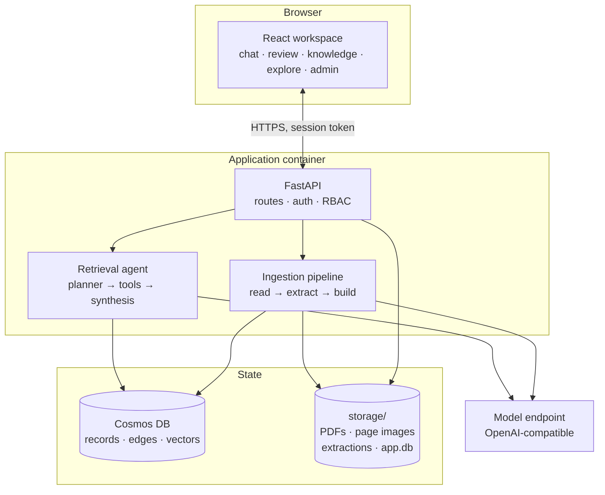
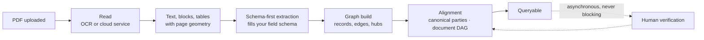
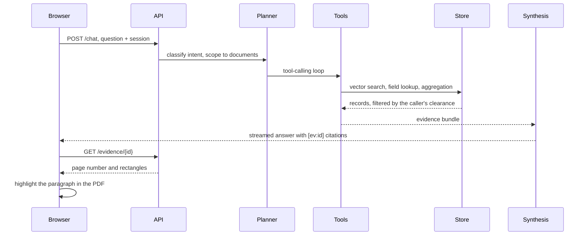

# Architecture

What the pieces are, what talks to what, and where state actually lives. Read
[Concepts](concepts.md) first if you want to know why, rather than what.

## 01 · One image, three layers

The whole application is a single container. The React workspace is built into
it and served by the same process that serves the API, so there is one thing
to deploy and one port to expose.

Two rules about this picture are load-bearing.

**Only `pipeline/store/` talks to the database.** Every query goes through it,
including from the API. That is what makes the emulator and a real Cosmos
account behave identically, and it is where the emulator's quirks are
contained.

**The database is a projection, not a record.** Everything in it can be
rebuilt from `storage/` for free, with no model calls, by
`python -m scripts.rebuild_kb`. That is why ontology changes are cheap: you
change the shape, you rebuild, you look. If you lose the database container
entirely you have lost nothing.

## 02 · Where state lives

| What | Where | Rebuildable |
| --- | --- | --- |
| Original PDFs | `storage/pdfs/` | No. This is the only irreplaceable thing |
| Page images | `storage/pages/` | Yes, free, from the PDFs |
| Read text with geometry | `storage/canonical/` | Yes, but re-reading costs money |
| Field extractions | `storage/fields/` | Yes, but re-extracting costs money |
| Embeddings | `storage/emb_cache/` | Yes, cheaply |
| Accounts, sessions, chat threads, votes, feedback | `storage/app.db` | No. This is real user data |
| Graph records, edges, vectors | Cosmos container | Yes, free, from everything above |

Back up `storage/`. Everything else follows from it. The backup section of
[Deployment](DEPLOYMENT.md) has the specifics.

## 03 · A document arriving

Each stage writes a cached artifact, so re-running is free and the chain is
resumable. The two stages that spend money are reading the pages and filling
the fields. Everything after the `canonical` seam is deterministic Python with
no model involved.

The dotted path matters. Verification is not in the line. A document is
searchable the moment the build finishes, and review upgrades its trust tier
afterwards.

Stage-by-stage detail, including what each one writes and what it costs, is in
[Pipeline overview](PIPELINE_OVERVIEW.md).

## 04 · A question arriving

Three things about this loop are not negotiable.

**Clearance is applied at the source.** The store filters by the caller's role
before results reach the agent. A user without clearance never receives the
confidential value in the first place, so the browser is never trusted to hide
it.

**Citations are validated, not merely produced.** A guard rejects any evidence
id the store did not actually return in that turn. A model cannot cite
something it did not receive, which is the difference between a citation and a
plausible-looking reference.

**Arithmetic is Python.** Aggregation tools compute totals and comparisons
directly. The model chooses which tool to call and how to phrase the answer.
It does not do the sum.

The tool surface and how the planner routes to it are in
[Retrieval](retrieval.md).

## 05 · The module map

| Path | Role |
| --- | --- |
| `pipeline/extraction/` | Readers, schema-first field extraction, evidence anchoring |
| `pipeline/kb/` | Graph build, derivation, alignment, the document DAG, per-field supersedence |
| `pipeline/store/` | The only code that talks to the database. Sync and async clients, SQL builder, item shapes |
| `pipeline/config.py` | Runtime settings from the environment |
| `api/rag/` | Planner, tool surface, agent loop, synthesis, citation guard, sensitivity policy |
| `api/routes/` | HTTP surface, one module per area |
| `api/appdb.py` | SQLite: accounts, sessions, threads, votes, feedback |
| `web/src/` | The React workspace |
| `configs/` | The whole domain definition. See [Domains](domains.md) |
| `scripts/` | Operational commands. See [Reference](reference.md#commands) |
| `eval/` | The extraction scorer |

Each of those directories has its own README with a per-file table.

## 06 · Choices worth knowing about

**Cosmos DB NoSQL, one container.** Records, edges and vectors share a single
container. It runs locally in Docker as an emulator and on Azure unchanged.
Vector search is exact and in memory during development
(`COSMOS_VECTOR_MODE=client`) and uses the database's own index on a real
account (`native`). Same code either way.

**SQLite for application state.** Accounts, sessions, threads and votes are
small, transactional and local. They do not belong in the document store, and
they are the one thing in `storage/` that is not rebuildable.

**Passwordless sign-in.** An email address alone signs you in. That is
demo-grade by design and correct for a laptop. It is not authentication for a
shared network, and both [SECURITY.md](../SECURITY.md) and
[Deployment](DEPLOYMENT.md) say what to put in front of it. The app logs its
own security posture on every boot so an operator can see the answer in the
log rather than by reading code.

**Server-side roles.** A session carries a role resolved on the server. The
client never sends its own clearance, and every route is gated. A test sweeps
the application's own routing table and requires every endpoint to refuse an
anonymous caller unless it is on a short explicit public list, so a new
endpoint is protected by default rather than by somebody remembering.

## 07 · What runs where

| | Development | Production |
| --- | --- | --- |
| App | `docker compose up -d`, or uvicorn plus the Vite dev server | `docker-compose.prod.yml`, bound to loopback behind your own reverse proxy |
| Database | Cosmos emulator in Docker | A real Cosmos account, or the emulator if you accept its limits |
| Vector search | Exact, in memory | The database index |
| Storage | A local folder | A mounted volume, optionally mirrored to Blob |
| Logs | Human readable | `LOG_FORMAT=json` |

One image runs in both. Every difference is an environment variable.
