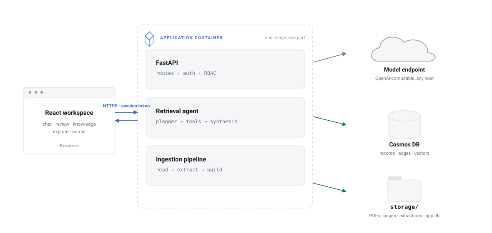
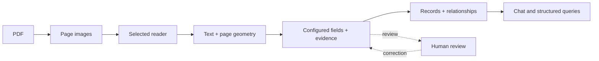
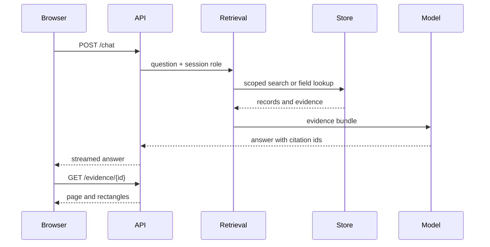

# Architecture

DIVA has one application container and one knowledge store. The application
serves the React web client and the FastAPI API from the same origin. It reads
and writes pipeline files under `storage/`, and projects searchable records to
Azure Cosmos DB or the local emulator.

<picture>
  <source media="(prefers-color-scheme: dark)" srcset="diagrams/architecture-dark.svg">
  
</picture>

## Runtime components

| Component | Location | Responsibility |
| --- | --- | --- |
| Web client | `web/` | Chat, review, knowledge, graph, and admin screens |
| HTTP API | `api/` | Routes, sessions, roles, uploads, and streaming answers |
| Retrieval | `api/rag/` | Select tools, gather evidence, and format cited answers |
| Ingestion | `pipeline/` | Render PDFs, read pages, extract fields, and build records |
| Domain configuration | `configs/` | Fields, document types, graph vocabulary, and prompts |
| Application state | `storage/app.db` | Accounts, sessions, threads, review votes, and feedback |
| Document artifacts | `storage/` | PDFs, page images, extracted text, geometry, and caches |
| Knowledge store | `pipeline/store/` | The only code that talks to Cosmos DB |

The frontend is built during the Docker image build and served by FastAPI. A
frontend change therefore needs a new image. A backend source mount in the
development Compose file can be picked up after a restart.

## A document moving through the system

The selected reader is controlled by `READER`:

| Setting | Reader | Output |
| --- | --- | --- |
| `READER=rapidocr` | Local RapidOCR plus the correction/classification pass | Page text, blocks, and OCR-derived geometry |
| `READER=cu` | Azure Content Understanding | Page text, layout, tables, and geometry from one document analysis call |

Both readers write the page representation consumed by the later pipeline. The
default Docker image installs `rapidocr` and `onnxruntime`, and it does not install
the `paddleocr` Python package. RapidOCR uses PP-OCR-derived ONNX models, and
the local path derives block rectangles from the OCR line boxes. See
[Pipeline overview](PIPELINE_OVERVIEW.md) for the exact artifacts.

## Where state lives

| Data | Location | Can it be rebuilt? |
| --- | --- | --- |
| Original PDFs | `storage/raw/` | No, keep a backup |
| Rendered pages | `storage/pages/` | Yes, from the PDFs |
| Text and geometry | `storage/pages_md/`, `storage/doc/`, `storage/doc_geometry/` | Yes, by re-reading the PDFs |
| Field results | `storage/fields/` and `storage/canonical/` | Yes, by re-running extraction |
| Embeddings | `storage/emb_cache/` | Yes, by re-embedding |
| Accounts and review history | `storage/app.db` | No, back it up |
| Searchable records and edges | Cosmos container | Yes, from the files in `storage/` |

The practical backup unit is the `storage/` directory. The Cosmos projection can
be rebuilt with `python -m scripts.rebuild_kb`.

## A question moving through the system

The store applies the caller's role before evidence reaches the model or the
browser. Structured aggregations are calculated in application code. A citation
guard removes ids that were not part of the evidence returned for that answer.

## Development and production

| Area | Development | Production |
| --- | --- | --- |
| Application | `docker compose up -d` | `docker-compose.prod.yml` |
| Database | Cosmos emulator | Azure Cosmos DB account or an explicitly managed emulator |
| Vector search | `COSMOS_VECTOR_MODE=client` | Usually `native` on Azure |
| Files | Local `storage/` bind mount | Persistent volume, optionally mirrored to Blob |
| Logs | Human-readable | `LOG_FORMAT=json` |

The application image is the same in both cases. Environment variables select
the model endpoint, document reader, database, storage, and access settings.

## Source map

| Path | Start here when you need to change… |
| --- | --- |
| `pipeline/extraction/` | Readers, geometry, field extraction, and validation |
| `pipeline/kb/` | Record creation, document relationships, and current values |
| `pipeline/store/` | Cosmos access and query behavior |
| `api/routes/` | HTTP endpoints |
| `api/rag/` | Retrieval tools and citations |
| `web/src/` | The browser workspace |
| `configs/` | Domain behavior without changing Python |
| `scripts/` | Setup, rebuild, and operational commands |

For dependency versions and runtime switches, see [Tech stack](tech_stack.md).
