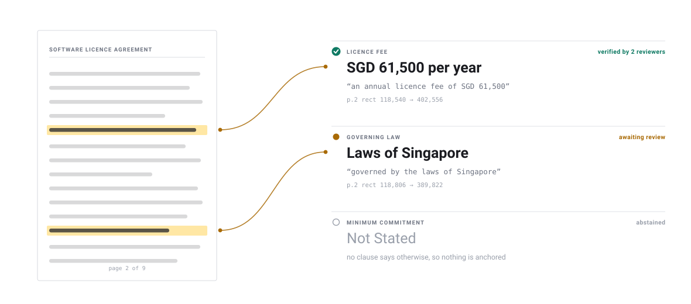
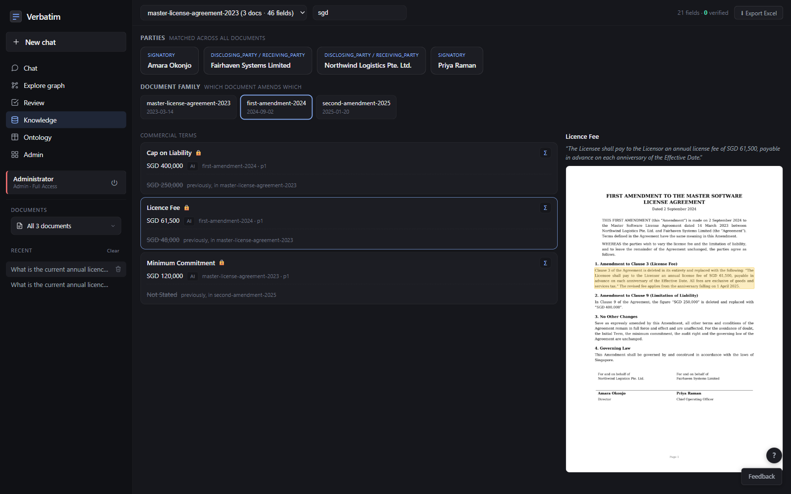
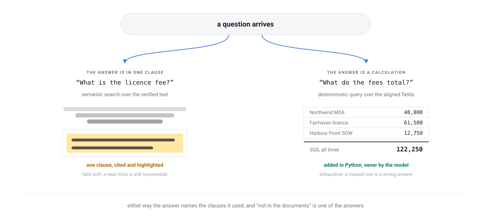

# Concepts

Why the system is shaped the way it is. Read this if you are deciding whether
to use it, or if you are about to change something and want to know what you
would be breaking.

## 01 · The problem with the obvious approach

The obvious way to answer questions about a pile of contracts is to chop them
into passages, embed the passages, retrieve the closest few to the question,
and let a language model write an answer. That works well enough for "what
does this clause say" and falls apart on the questions people actually ask a
contract archive.

| The question | Why passage retrieval fails |
| --- | --- |
| "What is the current fee?" | The current fee is not in any one passage. It is whichever passage is latest in an amendment chain that nobody wrote down |
| "What do the deposits add up to?" | Retrieval returns some of the deposits. A model then adds them, badly, and states the total with confidence |
| "Which sites have a renewal right?" | The answer requires every document, not the closest five |
| "Is there a service credit regime?" | There is not, and the model says something anyway |
| "Where does that number come from?" | The passage is cited. Whether the number was actually in the passage is not checked |

The last two matter most. A contracts archive is used to make decisions with
money attached, and a confident wrong answer is worse than no system at all.

<a id="schema-first"></a>

## 02 · Schema-first extraction

Instead of mining open-ended text, a model fills in a field schema you wrote.

```yaml
license_fee:
  title: Licence Fee
  type: value
  multiplicity: 1
  hint: "The fee payable for the licence or subscription."
  source:
    mechanism: value
    label: Payment
    match: {parameter_any: [license_fee, licence_fee, subscription_fee]}
```

This dissolves a problem rather than solving it. If you let a model name the
things it finds, the same concept comes back as "annual licence fee", "yearly
subscription charge", "the Fee" and "licensing cost" across four documents,
and you spend the rest of the project writing code to decide those are the
same thing. A named field with a bounded type does not drift, because there
was never an open vocabulary to drift within.

Three rules follow from it, and they are enforced rather than encouraged:

- **The schema is the only target.** Content that does not map to a field is
  quarantined for review. It is never silently dropped and it is never
  silently added to the schema at runtime.
- **"Not Stated" is a valid value.** Abstaining is a correct outcome, and the
  scorer counts a correct abstention as a success rather than a miss.
- **The model extracts, it does not decide.** New field definitions are
  proposed to a human, never self-registered.

The full authoring guide is in [Domains](domains.md).

<a id="evidence"></a>

## 03 · Evidence anchoring

Every value carries the verbatim snippet it came from and the rectangle on the
page where that snippet sits.

<picture>
  <source media="(prefers-color-scheme: dark)" srcset="diagrams/evidence-chain-dark.svg">
  
</picture>

This is the load-bearing part of the design, and the reason is practical
rather than aesthetic. A reviewer approving a field is being asked to certify
that a value is right. They can only do that if they can see the clause it
came from, on the page, in context. If the highlight is off by a paragraph the
reviewer approves the wrong thing, and every downstream guarantee built on
that approval is fiction.

So bbox fidelity outranks features. A change that adds capability and degrades
anchoring is not an improvement.

Notice the third row in the figure. It says "Not Stated" and it has no thread,
because there is nothing on the page to point at. That is the correct shape
for an abstention: not a blank cell that looks like a bug, but an explicit
statement that the documents are silent.

<a id="verification"></a>

## 04 · Human verification

Extraction is allowed to be imperfect, because every field is reviewed.

That is a design decision, not a concession. Optimising for unattainable
per-field perfection produces a system that guesses when it is unsure, because
guessing scores better than abstaining. Optimising for honest, evidence-anchored
assignment plus graceful abstention produces a system whose mistakes are visible
and cheap to fix.

Four properties make review survivable at scale:

| | |
| --- | --- |
| **Never blocking** | A document is searchable the moment it lands. Verification runs afterwards and upgrades the trust tier. It is an accountability layer, not a gate |
| **Triaged** | Uncertain and high-value fields surface first, in a green, amber and red ordering, so the scarce resource (attention) goes where it changes an answer |
| **Corrections generalise** | A fix becomes a definition, an alias, or a rule, so the next document resolves on its own. Review once, fixed forever. Never per-document special cases |
| **Voted** | Verification is a consensus among approved verifiers, and the majority decides. One person cannot quietly stamp the archive |

Verified values carry a trust tier and lineage, so an answer can say who
certified the number and when.

## 05 · Aligned knowledge

Because every document fills the same verified fields, cross-document work
becomes ordinary code rather than model guesswork. Three deterministic layers
sit on top, and none of them calls a model.

### Entity resolution is resolve-and-link, never mint-new

A mention of a party in a document is linked to a canonical hub through a
multi-signal match on name, context and identifiers. When the signals are not
strong enough it abstains and flags for review rather than creating a new hub.

The failure mode this avoids is the one that quietly ruins a knowledge graph:
minting "Fairhaven Systems Limited", "Fairhaven Systems Ltd" and "Fairhaven
Systems" as three separate entities, after which every aggregate is wrong and
nobody can tell.

### The document family is declared, not inferred

Contracts say what they amend, in their own recitals:

> THIS SECOND AMENDMENT is made on 20 January 2025 to the Master Software
> License Agreement dated 14 March 2023 between Northwind Logistics Pte. Ltd.
> and Fairhaven Systems Limited, as amended by the First Amendment dated
> 2 September 2024.

So the chain is extracted and verified as ordinary fields, like any other. It
is never guessed from filenames, dates or folder structure. A missed edge
silently detaches a document from its chain and makes every "current" answer
about it wrong, which is why these fields are force-verified.

### "Current" is resolved per field

The latest document in the chain that sets a field wins. Fields nobody re-sets
inherit from the parent.

<picture>
  <source media="(prefers-color-scheme: dark)" srcset="diagrams/supersedence.gif">
  
</picture>

The subtlety is what a blank means, and it depends entirely on where the
document sits in the chain:

| A blank in | Means |
| --- | --- |
| A base agreement | Not stated. The contract is silent on this |
| An amendment | Unchanged. Inherit whatever the parent said |

Same absence, opposite meaning. This is pure code with no model involved, and
it is the single most common source of wrong answers in systems that skip it,
because "read the newest document" is such a reasonable-sounding heuristic.

On screen the result is one row per field: the value in force, the document
that set it, and everything it replaced still legible underneath.



## 06 · Two retrieval modes

The kind of question decides the machinery.

<picture>
  <source media="(prefers-color-scheme: dark)" srcset="diagrams/retrieval-modes-dark.svg">
  
</picture>

**Semantic search over the verified text**, for single-fact lookups where the
answer sits in one clause. This mode fails soft: a near miss returns a nearby
clause, the citation shows it, and a person can see what happened.

**Deterministic queries with exact arithmetic**, for totals, comparisons, and
anything that turns on which value is current. This mode has to be exhaustive,
because a missed row is not a slightly worse answer, it is a wrong number.

Sums are computed in Python. Not by a model, not by asking a model to
summarise partial results, ever. That approach cannot do arithmetic reliably,
cannot guarantee it saw everything, and cannot tell you which of five versions
of a clause is in force.

Canonicalisation is narrow on purpose. Only the dimensions the structured
operations join and aggregate on get canonicalised. Everything else stays as
text, where semantic search handles it perfectly well.

## 07 · Measurement

A free, deterministic scorer grades extraction field by field against a
human-verified gold set:

```bash
python -m eval.extraction.score --run NAME
```

It reports five outcomes plus evidence integrity: correct, correctly
abstained, missed, wrong, and invented. Verified documents become gold, so the
gold set grows as a side effect of using the product.

It calls no model and costs nothing, which is the point. A quality gate you
have to pay to run is a quality gate nobody runs.

## 08 · What this deliberately does not do

Being clear about the boundaries is more useful than a feature list.

| | |
| --- | --- |
| **It is not a general document chatbot.** | It answers from a schema you defined over a corpus you loaded. Point it at arbitrary PDFs with no schema and it has nothing to fill in |
| **It does not do global summarisation.** | There is no "summarise the whole corpus" mode. Aggregation is deterministic or it does not happen |
| **It does not run without human review.** | Review does not block ingestion, but an archive nobody has verified is an archive of machine guesses, and the trust tiers will say so |
| **It serves one domain per deployment.** | Two document types means two instances. Resolved once at startup, and the app refuses to start rather than guess |
| **It has no per-document special cases.** | Anything that would need one is a missing schema field or a missing rule. Adding a heuristic for one difficult contract is how a system stops scaling |

## Further reading

| | |
| --- | --- |
| How the pieces fit together | [Architecture](architecture.md) |
| Writing a schema for your own documents | [Domains](domains.md) |
| Stage-by-stage ingestion detail | [Pipeline overview](PIPELINE_OVERVIEW.md) |
| How a question becomes tool calls | [Retrieval](retrieval.md) |
