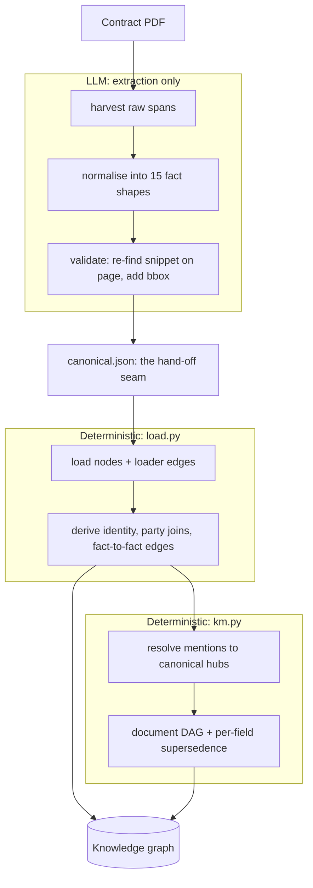
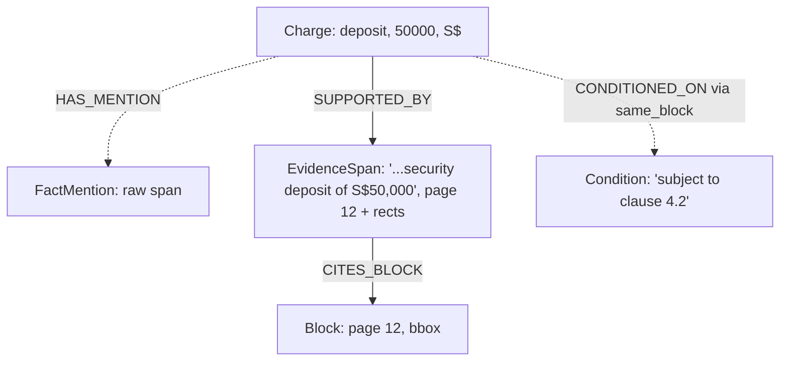

# Data model: how the knowledge graph is built

> Companion to [`retrieval.md`](retrieval.md). Machine-readable sources of truth:
> the active domain's [`configs/ontology/`](../configs/ontology/) (graph shape) and
> [`configs/packs/`](../configs/packs/) files. This doc explains why the model is shaped this way.
>
> Scope (2026-07): this covers the **fact graph**, the open-vocab typed-fact
> layer that remains the extraction default. The **aligned KM layer** sits on
> top: one `OpsField` record per ops-view field per document with trust tier and
> evidence, a recital-declared document DAG, and per-field supersedence, built
> deterministically by `pipeline/kb/km.py` (`python -m scripts.build_km`). Both
> layers share the citation backbone below.
>
> Where it lives: the whole model is projected into one Azure Cosmos DB NoSQL
> container. Every node below becomes a record with a `kind`, attachment edges
> become fields on the child record, and semantic edges become `kind=edge`
> items (mapping in `storage/migration/port_notes.md`). `pipeline/store/` is
> the only layer that talks to Cosmos, and `python -m scripts.rebuild_kb`
> rebuilds the container from `storage/` for free.

The one-sentence version: every fact in a contract becomes a node, every node
carries a chain back to the exact pixels that prove it, every connection is
either copied from the document or derived by a rule, and mentions of the same
party resolve to one shared canonical entity so a question can span documents.
If the answer is highlighted, a reader can trust it.

---

## 01 · Lifecycle: PDF to knowledge graph

One input (the document) and two engines: the LLM, which only ever emits facts,
and deterministic code, which does everything else.

The single seam is `canonical.json`. Left of it the LLM reads pixels and
produces facts. Right of it everything is deterministic: same inputs, identical
graph, every time.

---

## 02 · Seven layers, 26 node types

| Layer | Nodes | The question it answers |
|---|---|---|
| document | `Document`, `Agreement` | which PDF, which contract (`doc_id = sha256(pdf)[:16]`) |
| layout | `Section`, `Block` | where on the page this lives, every block keeps page, bbox, embedding |
| fact | 15 typed labels | what the contract actually says |
| provenance | `FactMention` | what we saw before cleanup, the raw-span floor |
| evidence | `EvidenceSpan` | the exact text and pixels that prove a fact |
| identity | the `Canonical*` hubs your domain declares | is this the same party, term or place as elsewhere |
| quarantine | `Proposal` | what we refused to trust without a human |

## 03 · The fact layer: 15 kinds of fact

The extractor is only ever allowed to emit these. It cannot invent a category.

| Fact | Captures | Example |
|---|---|---|
| `Party` | a contracting party or named person | Northwind Logistics Pte Ltd |
| `Location` | a site, premises, address | the chiller plant room |
| `Equipment` | a plant or equipment item | a 200 RT magnetic-bearing chiller |
| `Charge` | a money fact: deposit, fee, lump sum | S$50,000 security deposit |
| `Rate` | a priced rate per unit per period | S$0.18 per RT-hr |
| `CostCategory` | a named cost bucket with no amount | "Energy Charge" |
| `Formula` | a tariff or adjustment calculation | the consumption-charge formula |
| `Date` | a typed date | commencement date |
| `Measurement` | a quantified parameter | supply temperature 6 °C |
| `Obligation` | who must do what, by when | the Supplier shall maintain... |
| `Right` | who may do what | the Customer may terminate if... |
| `Condition` | an if / subject-to clause gating other facts | "subject to early termination" |
| `Event` | a trigger occurrence | an Event of Default |
| `DefinedTerm` | a capitalised term and its definition | "Commissioning" means... |
| `Schedule` | an attached schedule or annex | Appendix 1, Equipment List |

Each fact is scoped to one document and carries type-specific properties plus a
confidence.

---

## 04 · Provenance discipline: every edge declares how it got there

This is the line between "the document said so" and "we worked it out", and it
is enforced by the ontology, not aspirational.

| Provenance | Meaning | Examples |
|---|---|---|
| `loader` | written directly from extraction artifacts, the document contains it | `HAS_SECTION`, the 15 `HAS_*` attachments, `SUPPORTED_BY` |
| `derived:in_graph` | a deterministic rule over loaded nodes: same input, same edges | `IMPOSED_ON`, `HELD_BY`, `CONDITIONED_ON`, `TRIGGERED_BY`, `RESOLVES_TO` |
| `derived:text_match` | deterministic string matching over evidence text | `USES_TERM`, `REFERENCES_SCHEDULE` |
| `asserted:review` | enters the graph only after a human approves a `Proposal` | `LIMITED_BY`, `EXCEPTION_TO` |

The LLM's job stops at emitting atomic facts. It never writes a connection, so
the graph cannot quietly hallucinate a relationship. Derived fact-to-fact edges
also record how close the evidence was (`via`: `same_block`, `same_section`, or
`cross_ref`).

There used to be a further layer here that bound each identity hub to a row in
an external register of customers and assets that the deployment maintained
alongside its documents. That register was one firm's master data rather than
part of the framework, and it has been retired. Resolution now ends at the
identity hub, which is what makes documents joinable to each other.

---

## 05 · Two design choices worth knowing

- **The provenance floor.** Before cleanup (merging duplicates, dropping weak
  stubs) every raw span is recorded as a `FactMention` with its page geometry.
  `EvidenceSpan` is the polished citation. `FactMention` is the complete,
  unfiltered mirror underneath, so a discarded fragment stays searchable and
  highlightable.
- **Identity is gated, not greedy.** Only supplier and customer roles mint a
  `CanonicalParty` (suffix-invariant, so "X Pte Ltd" and "X Private Limited"
  unify). Signatories and witnesses never do. This keeps cross-document joins
  high-precision.

---

## 06 · Worked example: one fact, end to end

> "The Customer shall pay a security deposit of S$50,000."

Layout captures the paragraph as a `Block`, and the LLM normalises the money
span into a `Charge`. The raw span is mirrored as a `FactMention` and the
polished citation as an `EvidenceSpan` pointing at the exact pixels, then
deterministic load derives `CONDITIONED_ON` from the adjacent clause. When the
chatbot answers
"how much is the deposit?", the UI highlights the precise rectangle on page 12,
and because the `Agreement` is grounded, the answer can also say which customer
and site the deposit belongs to. Nothing in the chain was guessed.

---

## 07 · Built since the base schema

- **Versioning / supersedence**, twice over: agreement-level timeline edges
  detected from recital text (`pipeline/kb/timeline.py`,
  `AMENDS`/`SUPERSEDES`/`NOVATES`, gated), and the KM layer's document DAG with
  per-field supersedence (`pipeline/kb/km.py`). Retrieval tags values CURRENT
  vs superseded (`lookup_current_value`).
- **LLM-proposed relations** exist as the proposal channel
  (`relation_propose.py` + `proposal_review.py`): proposals carry evidence and
  are promoted or rejected through review, never auto-asserted.

Regenerate the mechanical ontology diagram with
`python -m scripts.render_ontology`, which writes a readable page for whichever
domain this instance serves.
