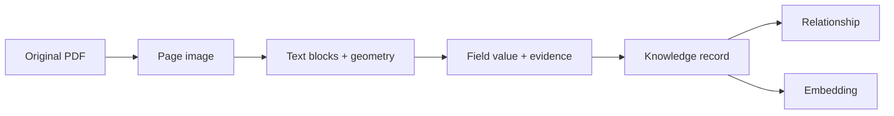

# Data model

DIVA keeps the document archive on disk and stores a searchable projection in
Cosmos DB. The split is useful: files preserve the source and intermediate
artifacts, while the database supports chat, graph views, and structured
queries.

## From a page to a record



## Files on disk

| Artifact | Purpose |
| --- | --- |
| `storage/raw/` | Source PDFs and intake metadata |
| `storage/pages/` | Rendered page images |
| `storage/pages_md/` | Reader-neutral text and block structure |
| `storage/doc/` | Clean merged document text |
| `storage/doc_geometry/` | Page-relative rectangles keyed by block id |
| `storage/fields/` | Domain field values and their evidence |
| `storage/canonical/` | Canonical extraction records used by loading |
| `storage/emb_cache/` | Cached vectors |
| `storage/quarantine/` | Items held for review instead of being discarded |

`doc.json` contains text that is convenient for models and queries. Its
companion `doc_geometry.json` contains the rectangles needed by the PDF viewer.
Keeping them separate avoids sending geometry through every text operation while
preserving the link needed for evidence.

## Knowledge-store records

The `kb` Cosmos container holds records, edges, and embeddings. Records are
partitioned by `pk`. The access code in `pipeline/store/` handles the item shape
and query details.

The important record groups are:

| Group | Represents |
| --- | --- |
| Documents | A source document, its metadata, date, type, and family membership |
| Fields and facts | Values extracted from a document, including status and source |
| Parties and sites | Canonical entities shared by related documents |
| Evidence | The snippet, page, and rectangles supporting a value |
| Sections and blocks | Searchable text units with document and page identity |
| Edges | Declared or derived relationships between records |
| Vectors | Embeddings attached to searchable records |

The exact JSON keys are implemented in `pipeline/kb/` and `pipeline/store/`.
Those modules, rather than this guide, are authoritative when adding a field or
record type.

## Evidence shape

An evidence item connects a value to its source using:

```text
document id
page number
source snippet
block id or row id
one or more page-relative rectangles
confidence and review status
```

The page-relative rectangle is derived from the reader geometry. For the local
RapidOCR reader, the block rectangle is the union of the OCR line boxes. Table
repair can add row rectangles so a table citation highlights the relevant row
rather than the whole table.

## Document families and current values

Documents can be connected by relationships such as `AMENDS`, `SUPERSEDES`, or
`NOVATES`. A family stores the source documents and the order in which they
relate. Current-value resolution then walks the family separately for each
field.

```text
master agreement ──AMENDS──> first amendment ──AMENDS──> second amendment
       fee: 48,000              fee: 61,500                 fee: silent
       term: 3 years             term: silent                term: 5 years
```

The resulting current record is `fee = 61,500` and `term = 5 years`. Silence in
the latest document does not replace an earlier value. A field that is actually
removed can be represented as an explicit correction or deletion according to
the active domain's rules.

## Review status

Field records keep the machine result and the human decision separate. A review
vote can approve, reject, or correct a value and can attach better evidence.
The approval counts are configured by `REVIEW_MIN_APPROVALS` and
`REVIEW_CORRECTION_APPROVALS`.

This history matters when rebuilding the searchable projection: the projection
can be recreated from extraction files and application review state without
changing the original PDF.

## Rebuild behavior

Cosmos is a projection, not the only copy of the document data. Rebuild it with:

```bash
python -m scripts.rebuild_kb
```

The rebuild uses the local artifacts and cached embeddings. It does not need a
model call. Back up `storage/`, especially `storage/raw/` and `storage/app.db`.

For the pipeline that produces these records, see [Pipeline overview](PIPELINE_OVERVIEW.md).
For the query side, see [Retrieval](retrieval.md).
