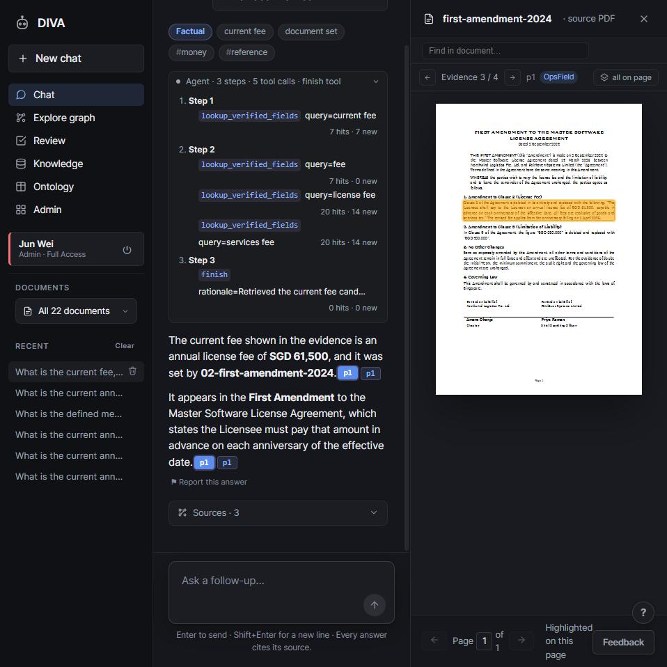

# Getting started

By the end of this page you will have the application running, three sample
contracts loaded, and an answer on screen that cites the clause it came from.
Budget about twenty minutes, most of which is waiting for a download.

Everything except reading the documents is free. The three sample contracts
are short, and reading all three cost about 27,000 tokens in total the last
time this page was checked, which is small change on any current model. Real
contracts are longer and cost more. The detail is in
[Costs](#what-this-costs).

## 01 · What you need

| | |
| --- | --- |
| Docker | For the database, and the easiest way to run the app itself |
| A model API key | Any OpenAI-compatible endpoint. OpenAI itself, Azure AI Foundry, a gateway, or a server on your own network |

Python 3.11 or newer is only needed for the advanced scripted setup or for
running without Docker, both covered near the end of this page. The path
below never touches a command line beyond the three lines under Install.

Nothing else phones home. Your documents go to the model endpoint you
configure and nowhere else.

## 02 · Install and start

```bash
git clone https://github.com/awpbash/verbatim.git
cd verbatim
cp .env.example .env
docker compose up -d
```

Nothing in `.env` needs editing. `docker compose up -d` starts both the
database and the app, and the wizard that opens next is where you put in your
model key. First boot takes about a minute while the database container
becomes healthy.

## 03 · The setup wizard

Open <http://localhost:8000>. A short wizard runs in the browser instead of
any file editing:

1. **Name the instance**, the label shown in the browser tab and header.
2. **Create your admin account.** Whatever email you type here becomes your
   real sign-in, replacing a temporary placeholder account the app creates
   for itself before the wizard finishes.
3. **Paste in a model API key.** It is tested live, one small request,
   before the wizard lets you continue, so a typo is caught immediately
   rather than on your first upload.
4. **Choose how to start.** Four paths: **Demo** loads the three sample
   contracts below automatically. **Ready-made, as-is** gives you the
   shipped `commercial_agreement` schema untouched, which is what the rest
   of this page assumes so the manual walkthrough in the next step still
   has something to show you. **Clone and edit** starts from that same
   schema but lets you reshape it first. **Build from scratch** drafts a
   field list from a one-sentence description of your own kind of document.
   Clone-and-edit and build-from-scratch open a field editor before the
   final step.

Finishing restarts the app once, about a couple of seconds, and signs you
straight in as the admin account you just created. There is no separate
login screen to find afterward.

> Sign-in is passwordless everywhere in this app, wizard-created account
> included. Typing a known email address signs you in, with no password
> step. That is deliberate and it is fine on your own machine. It is not
> authentication for a shared network. Before you put this anywhere other
> people can reach, read [SECURITY.md](../SECURITY.md) and the posture
> section of [DEPLOYMENT.md](DEPLOYMENT.md).

**Picked Demo?** It just did the whole of step 04 below for you. Skip ahead
to [05 · Ask it something](#ask-it-something).

To run without Docker instead, the same wizard runs against the dev server:

```bash
python -m uvicorn api.main:app --reload --port 8000
cd web && npm install && npm run dev      # http://localhost:5173
```

<a id="04--load-the-sample-contracts"></a>

## 04 · Load the sample contracts

Three synthetic contracts ship in [`examples/corpus/`](../examples/corpus).
They are a base software licence agreement and two amendments to it, and they
are shaped to demonstrate the thing most retrieval systems get wrong. Load
them in this order:

1. `01-master-license-agreement-2023.pdf`
2. `02-first-amendment-2024.pdf`
3. `03-second-amendment-2025.pdf`

Go to the **Admin** tab and upload each one. For each, declare what you know:
put all three in one new folder, set the type and date, and for the two
amendments set the relationship to **amends** the master agreement. Those
declarations are what put the three documents in one chain, and they come from
you rather than from the model. (The Demo path in the wizard makes these same
three declarations automatically, which is the whole reason it exists as a
separate choice from Ready-made-as-is.)

Extraction starts on upload and runs in the background, about half a minute per
document here. A job ticker shows progress, and each document becomes
searchable as soon as its own extraction finishes. You do not have to wait for
all three before asking about the first.

Use the Admin tab for this walkthrough. The command line reads a document but
does not declare its place in a family, and it stops short of the review record
and the knowledge layer, so you would need the whole chain by hand:

```bash
python -m pipeline.ingest examples/corpus/01-master-license-agreement-2023.pdf
python -m pipeline.kb.field_llm --all      # fill the schema from what was read
python -m scripts.build_km                 # rebuild the aligned knowledge layer
```

Every stage is cached. Running any of it a second time on the same document
does no work and spends nothing.

<a id="ask-it-something"></a>

## 05 · Ask it something

Go to the **Chat** tab and ask:

> What is the current annual licence fee?

The answer should be **SGD 61,500**, and it should cite the First Amendment.

That is the interesting part. The base agreement says SGD 48,000. The Second
Amendment is the newest document and says nothing about the fee at all. A
system that reads the newest document answers wrongly, and a system that reads
the base agreement answers wrongly in the other direction. The correct answer
lives in the middle document, and it is found by walking backwards along the
amendment chain until a document actually sets that field.

<picture>
  <source media="(prefers-color-scheme: dark)" srcset="diagrams/supersedence.gif">
  
</picture>

Now click the citation. The PDF opens on that page with the paragraph
highlighted. That link, from the value back to the pixels, is the thing the
whole design is arranged around.



[`examples/README.md`](../examples/README.md) has nine more questions with
their expected answers, including two that should be answered "not in the
documents". Getting those two right matters as much as getting the others
right.

## 06 · Verify a field

Go to the **Review** tab, open the folder, and open a document. Every extracted
field is listed with its evidence. Click a field and its clause is highlighted
on the page beside it.


Now open the **Second Amendment** for the interesting case.

That document does two things: it extends the term and it deletes the
termination clause. It says nothing about money, nothing about the audit right,
nothing about how long obligations survive. Read down its field list and you
will find at least one field it has answered anyway, pulled from a clause that
is about something else. Which field varies between runs, because model output
is not deterministic. In ours it was Survival Period, filled in from the
sentence deleting the termination clause. Earlier runs put `five (5) years`
into Minimum Commitment, taken from the sentence about the term.

You do not have to hunt for it. Click any field and its clause lights up on the
page beside it, so a value taken from the wrong sentence is visible in about a
second. That is the whole reason evidence is anchored.

Correct one. Choose **Propose correction** and enter `Not Stated`, which is how
you say this document does not state this field. The value immediately falls
back to whatever the base agreement said, which is the right answer, and the
wrong value stays in the record as history.

> A correction overrides the machine everywhere, so by default it asks for a
> second verifier to concur. On your own single-account instance nobody can
> concur, so set `REVIEW_CORRECTION_APPROVALS=1` in `.env` and restart
> (`docker compose up -d --force-recreate app`, since a plain restart does not
> re-read the file). Leave it at 2 wherever two people actually exist.

Ask the chat about that field again and the answer has changed. One verifier
action, and every answer downstream of that field is right.

Review never blocks anything. The documents were searchable before you opened
this tab. Verification is the accountability layer, not a gate.

## 07 · Where to go next

| Next | Page |
| --- | --- |
| Understand why any of this is shaped this way | [Concepts](concepts.md) |
| Point it at your own kind of document | [Domains](domains.md) |
| Put it on a server for other people | [Deployment](DEPLOYMENT.md) |
| Something went wrong | [Troubleshooting](troubleshooting.md) |

## Advanced: scripted setup, no browser

Everything the wizard does in steps 02 and 03, you can also do by hand. Useful
for scripting a deployment, for CI, or when you want the exact
dependency-order checklist below rather than a browser.

```bash
pip install -r requirements.txt
cp .env.example .env
```

Open `.env` and put your key in `OPENAI_API_KEY`. That is the only required
setting. Every other line has a default that targets the local Docker stack,
and [`.env.example`](../.env.example) explains each one where it sits.

On Windows, set `PYTHONUTF8=1` first and run every script as a module
(`python -m scripts.setup`, never `python scripts/setup.py`).

```bash
docker compose up -d cosmos
```

This is the Azure Cosmos DB emulator. It takes about a minute to become
healthy the first time, and the app creates its own database inside it at
boot. What it holds is a projection, not your data: if you lose the container
entirely, `python -m scripts.rebuild_kb` rebuilds all of it from your local
files, for free, with no model calls.

```bash
python -m scripts.setup
```

Optional, because the app does all of this for itself at boot: it creates the
database and the container if they are absent, and creates the first admin
account when there are none. What this command adds is a plain answer to "is
my configuration right", in dependency order, before you go looking in a
browser. It calls no model and costs nothing.

```
Setting up this instance

[  ok  ] Python 3.12
[  ok  ] Python dependencies
[  ok  ] Configuration source
         Read from .env
[  ok  ] Model API key
         Routing model calls to api.openai.com.
[  ok  ] Domain
         commercial_agreement
[  ok  ] Configuration
         12 node labels, 22 schema fields in 8 categories.
[  ok  ] Document chain
         every chain role maps to a declared field.
[  ok  ] Access policy
         every restricted label exists in the pack.
[  ok  ] Knowledge store
         http://localhost:8081 -> verbatim/kb  (database and container ready)
[  ok  ] Accounts
         Sign in as: admin@localhost
```

Re-run it any time. It overwrites nothing. `--check` reports without changing
anything, which is the right thing to run when something has gone wrong later.
A missing model key is a warning here, not a stop. Add `--check-models` for
proof the endpoint actually answers, one small embedding request costing a
fraction of a cent.

```bash
docker compose up -d
```

Open <http://localhost:8000> and sign in as `admin@localhost` (or
`BOOTSTRAP_ADMIN_EMAIL` if you set one), since there was no wizard step to
name your own account. From here, pick up this page again at
[04 · Load the sample contracts](#04--load-the-sample-contracts).

**To reset an instance back to this starting point**, whether it was set up
through the wizard or by hand: an admin can use the Danger Zone panel in
**Admin → Accounts** (only shown when the instance allows it), or run
`python -m scripts.reset_dev` from the command line. Either wipes the
database, the knowledge store, and the uploaded files, and clears which
domain is active, so the next boot opens the setup wizard again from scratch.

<a id="what-this-costs"></a>

## What this costs

Two things cost money, and both are cached so you pay once per document and
per question.

| | Cost | Cached |
| --- | --- | --- |
| Reading a document | Scales with pages, and the page reader dominates. The sample corpus came to about 27,000 tokens across its three documents | Yes, keyed by document |
| Filling the schema | One pass per document, roughly a page of prompt plus the document | Yes, keyed by document. **Not** invalidated by a schema change, so use `--force` after one |
| Asking a question | Small change. Several tool calls and one answer | No, each question is new work |
| Everything else | Nothing | Rebuilding the knowledge base, scoring extraction, and the whole test suite call no model at all |

That last row is deliberate. You should be able to verify a change to this
project without a funded API key.

To spend less while you are trying things out, set `READER=rapidocr` in `.env`
(it is the default). It runs optical character recognition on your own machine
and only pays for a correction pass, instead of sending every page to a cloud
document service.
