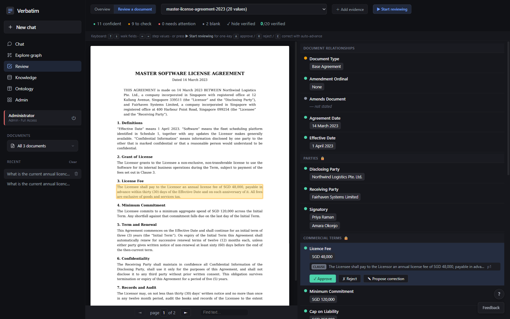

# Getting started

This guide takes a fresh checkout to a cited answer using the included sample
contracts. The first setup normally takes a few minutes, plus the time needed
to read the PDFs.

## What you need

| Requirement | Used for |
| --- | --- |
| Docker Desktop or Docker Engine with Compose | The app and the local Cosmos DB emulator |
| An API key for an OpenAI-compatible endpoint | Field extraction, embeddings, and chat |
| Python 3.11+ | Optional: command-line setup and maintenance scripts |

## Start DIVA

```bash
git clone https://github.com/awpbash/diva.git
cd diva
cp .env.example .env
docker compose up -d
```

Open <http://localhost:8000>. The first start can take a minute while the local
knowledge-store emulator becomes healthy.

The setup wizard asks for the instance name, the first administrator email, and
the model connection. It then offers four starting paths:

| Choice | Result |
| --- | --- |
| **Demo** | Load the three sample contracts and use the prepared schema |
| **Ready-made, as-is** | Use the shipped `commercial_agreement` schema |
| **Clone and edit** | Start from that schema and change its fields |
| **Build from scratch** | Draft an initial field list for your document type |

The default sign-in is passwordless and is intended for local evaluation. Read
the [security policy](../SECURITY.md) before putting an instance on a shared
network.

## Load the sample

If you chose **Demo**, the wizard loads the sample corpus. Otherwise open
**Admin**, upload these files in order, and declare the two amendments as
amending the master agreement:

1. `examples/corpus/01-master-license-agreement-2023.pdf`
2. `examples/corpus/02-first-amendment-2024.pdf`
3. `examples/corpus/03-second-amendment-2025.pdf`

The files are synthetic. The base agreement sets the original terms, the First
Amendment changes the fee and liability cap, and the Second Amendment changes
the term and removes the termination-for-convenience clause.

Extraction runs in the background. A document becomes searchable when its own
processing finishes. The whole collection does not need to finish first.

## Ask a question

Open **Chat** and ask:

> What is the current annual licence fee?

The answer should be **SGD 61,500**, with a citation to the First Amendment.
The latest document is silent about the fee, so DIVA follows the document
family to the latest document that states that field.

Select the citation to open the source PDF at the relevant page. The highlighted
text is the passage attached to the extracted value.


Try the other sample questions in [`examples/README.md`](../examples/README.md),
including questions whose correct answer is **Not Stated**.

## Review a field

Open **Review**, choose a document, and select a field. The field value appears
beside its source evidence.



Use **Approve**, **Reject**, or **Propose correction**. If an amendment does
not establish a field, correcting it to `Not Stated` allows the current-value
walk to use the earlier document that did establish it.

For a single-operator instance, set the following before proposing a correction
and recreate the app container:

```dotenv
REVIEW_CORRECTION_APPROVALS=1
```

## Scripted setup

The browser wizard is convenient for exploration. Use the scripts when setting
up CI or a repeatable environment:

```bash
pip install -r requirements.txt
cp .env.example .env
python -m scripts.setup --check
docker compose up -d cosmos
docker compose up -d app
```

Set `OPENAI_API_KEY` in `.env` before starting a real extraction. On Windows,
set `PYTHONUTF8=1` and run scripts as modules, for example
`python -m scripts.rebuild_kb`.

## Next steps

| Task | Guide |
| --- | --- |
| Understand the design | [Concepts](concepts.md) |
| Define your own fields and document relationships | [Domains](domains.md) |
| Follow ingestion and inspect its artifacts | [Pipeline overview](PIPELINE_OVERVIEW.md) |
| Find settings and commands | [Reference](reference.md) |
| Deploy for a team | [Deployment](DEPLOYMENT.md) |
| Diagnose a running instance | [Troubleshooting](troubleshooting.md) |

To reset a local development instance, use **Admin → Accounts → Reset** or run
`python -m scripts.reset_dev`.
