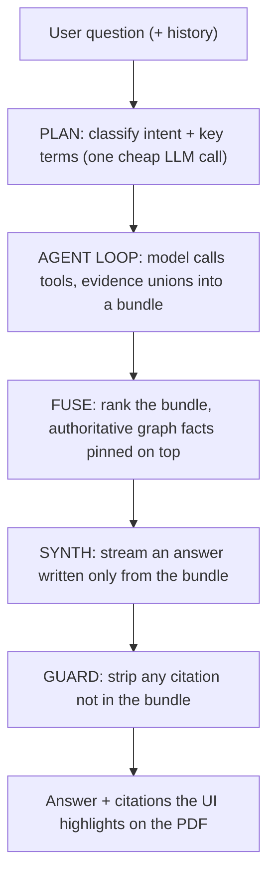

# Retrieval: how a question becomes a cited answer

> Companion to [`data_model.md`](data_model.md) (how the graph is built). Grounded
> in `api/rag/` (`planner.py`, `agent.py`, `tools.py`, `synth.py`, `citations.py`)
> and the streaming route `api/routes/chat.py`.

The one-sentence version: a question is classified, an agent gathers evidence
from the knowledge base by calling tools, and the answer is written only from
that evidence, with every claim tagged to a page span. Any citation the model
invents is deleted before it reaches the screen.

---

## 01 · The pipeline

- **Plan.** One small LLM call turns the question into an intent (factual,
  aggregation, cross_ref, ...) plus key terms. It decides shape, not answer. A
  one-shot query also builds a catalog of the documents in scope, so answers can
  name documents instead of bare ids.
- **Agent loop.** Up to 5 steps. Tool calls in a step run in parallel, and
  results union into a bundle keyed by `evidence_id`. A failing tool returns an
  error object to the model instead of crashing the turn.
- **Fuse.** Tools return incomparable scores (cosine vs keyword vs fixed), so the
  bundle is ordered by Reciprocal Rank Fusion: a span several retrievers agree
  on rises. Citations from authoritative tools (typed lookups, counts, sums)
  are pinned above fuzzy recall, so an exact rate is never buried under a chatty
  paragraph.
- **Synth.** A streamed completion writes over the bundle only. Aggregation
  results are rendered as an authoritative TOTALS preamble, so a "how many"
  answer uses the true database count, not the sample it can see.
- **Guard.** The token stream is filtered deterministically: an `[ev:id]` tag
  that is not in the retrieved bundle is deleted. A fabricated citation cannot
  reach the client, independent of how the model behaves.

---

## 02 · The toolbox

| Tool | Kind | When it fires |
|---|---|---|
| `vector_search_evidence` | dense (cosine) | open-ended or paraphrased questions |
| `keyword_search` | lexical (keyword score) | exact tokens meaning-search blurs: spec strings, amperages, acronyms |
| `vector_search_sections` / `vector_search_blocks` | dense | navigational ("what does Schedule 1B cover") / text that lives in a table or figure, not a typed fact |
| `lookup_section` / `lookup_defined_term` | structural | a named clause, or a defined term expandable across documents |
| `lookup_facts_by_label` | structural, typed + filters | clean structural shape ("the consumption charge rate") |
| `count_facts_by_label` / `aggregate_facts` | aggregation | true count / sum / avg / min / max from the database |
| `expand_cross_refs` | graph traversal | follow reference edges out of sections already found |
| `lookup_current_value` | supersedence | "most recent / currently in force": walks the amendment timeline, tags CURRENT vs superseded |
| `lookup_verified_fields` | KM layer | the question maps onto an ops-view field: returns per-document values with trust tier (human-verified vs AI-extracted), sensitivity-filtered at source by the session role |
| `aggregate_ops_fields` | KM aggregation | cross-document totals and comparisons over the aligned verified fields |
| `find_document_assets` | asset pointer | "where is the plant schematic": locates full-page diagram and drawing pages (image pages no text tool can find) and cites the document + page |
| `find_orphan_fragments` | last resort | raw dropped spans, when everything else found nothing |
| `finish` | control | the bundle is sufficient |

The two KM tools read the aligned `OpsField` records built by `scripts.build_km`.
The rest read the legacy fact graph and the raw text, the safety net when a
question does not map onto a defined field. Dense and lexical are deliberately
complementary and often called together. Under the hood every tool queries the one Cosmos container through
`pipeline/store/`. Dense tools rank embeddings exactly in RAM in dev
(`COSMOS_VECTOR_MODE=client`) or with native DiskANN on real Azure (`native`),
with identical top results. Keyword search is a deterministic token match
scored in Python.

---

## 03 · Two worked examples

**An aggregation (the count guarantee).** "How many obligations fall on the
supplier, and what is the total of all deposits?"

1. Plan: `intent=aggregation`.
2. Agent: `count_facts_by_label(Obligation, {actor_role: supplier})` returns a
   true count plus up to 5 sample spans, and `aggregate_facts(Charge, op=sum,
   filters={charge_type: deposit}, group_by=currency)` returns the real sum.
3. Synth leads with the TOTALS preamble, so the model reports N, not the 5
   samples it happens to see.
4. Why it holds: the count and sum are database numbers. The model is
   structurally prevented from answering "how many" with the sample size.

**When the answer is not there.** "Does the contract require ISO 9001
certification?"

1. Agent runs keyword, dense and typed lookups. All come back empty or weak.
2. Answer: "The contract does not state any ISO 9001 certification requirement."
3. Why it holds: no evidence, no claim. Even if the model invented an
   `[ev:...]`, the guard would strip it because the id is not in the bundle.
   "Not in the documents" is a correct answer, not a miss.

---

## 04 · Why an answer can be trusted

Enforced by the pipeline, not aspirations:

- **Grounded.** Synth sees the retrieved bundle and nothing else, and "not
  stated" is a valid answer. Connections (a charge's condition, a right's
  trigger) are traversed graph edges, not model inference.
- **Locatable.** Every citation carries page + rectangle geometry, so the UI
  highlights the exact spot. Fabricated citations are deleted deterministically.
- **Accountable.** Values from the KM layer carry their trust tier, so an answer
  can say whether an engineer has verified the number it used.

---

## 05 · What a citation carries, and operations

Each bundle entry has: `evidence_id`, page + bbox/rects (the highlight), the
verbatim snippet (plus full table row where relevant), the typed fact it backs,
section number/title, a confidence tier, and `linked_context` (conditions,
triggers, defined terms pulled along graph edges).

- Event order on the wire: `plan`, repeated `step`/`tool_call`/`tool_result`,
  `agent_done`, `citations`, `token` stream, `done`.
- `retrieval_only` mode stops after `citations` (scores retrieval without paying
  for synthesis, the eval path).
- `CHAT_DISABLED_TOOLS` env var switches off a misbehaving tool without a code
  change. Planner, agent and synth models are independently overridable.
